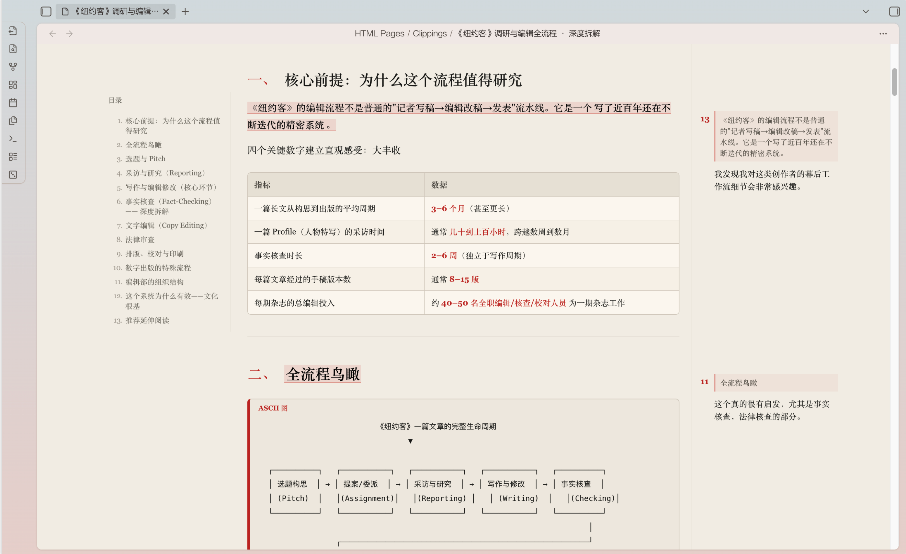

<div align="center">

# Notes to HTML Pages

**中文** · [English](README.en.md)

把 Obsidian Markdown 笔记变成适合深度阅读、可批注、可离线打开的 HTML 页面。


</div>

---

> **In English:** Notes to HTML Pages is an Obsidian plugin that turns Markdown notes into clean, standalone HTML reading pages. It includes a table of contents, in-app HTML reading, and selected-text annotations that can sync back to the source Markdown note. Full documentation: [README.en.md](README.en.md).

## 简介

**Notes to HTML Pages** 是一个面向长文阅读的 Obsidian 插件。它**把本地 Markdown 笔记转换成清晰、素净、有目录的 HTML 页面**，让调研、复盘、年度总结和深度文章更像一篇真正可读的文章或小册子。

导出的 `.html` 完全自包含：纯 CSS、内联资源、无需联网。你可以直接双击在浏览器打开，也可以在 Obsidian 的文件列表中直接阅读。**阅读过程中还可以选中文字划线、添加批注**，并默认同步回原来的 Markdown 笔记。

**适合的场景**

- 把长笔记、调研文档、年度总结或深度文章整理成更舒服的阅读版；
- 在长文中通过可点击目录快速跳转；
- 阅读时圈出重点、写下想法，并把批注留回原笔记；
- 需要可离线打开、归档或分享的单文件 HTML；
- 希望在不离开 Obsidian 的情况下完成阅读和批注。

## 效果预览


目录和右侧批注效果：


## 功能特性

- **自包含 HTML 导出**：导出当前笔记或整个文件夹为 `.html`。样式和可选的本地图片都写入页面，离线也能打开。
- **为长文设计的排版**：窄栏正文、衬线字体、清晰标题层级、引言、表格、引用块、重点提示、结论卡片，以及代码和 ASCII 图块。
- **双重目录导航**：文章开头自动生成可点击目录；宽屏阅读时，左侧还会出现跟随滚动的章节目录。
- **在 Obsidian 内直接阅读 HTML**：导出的 `.html` 会出现在文件列表中，点击即可在应用内打开，不再需要额外的入口笔记。
- **选择、划线与批注**：在 Obsidian 内阅读 HTML 时，选中任意长度的文本，包括跨行和跨段文字，即可划线并写下批注。
- **贴合阅读宽度的批注呈现**：空间足够时，批注在右侧留白区与原文对应；较窄时，带批注的段落末尾会出现小型批注入口，点击后在正文中展开内容。纯划线不会产生编号入口。
- **批注同步回 Markdown**：默认开启。批注的原文、备注与时间会写回源 Markdown，重新导出后仍会显示。关闭开关后，浏览器里仍可用于临时划线和备注，但不会改动原文。
- **可编辑、可删除**：点击批注进入编辑状态；保存更新同步回原文，删除也会同时清除页面与源笔记中的对应批注。
- **保留笔记结构**：默认保留文件夹层级；可把 Wikilink 转换为同名 HTML 链接，并可内嵌本地图片。
- **源笔记回链**：可选在源笔记开头维护一个整洁的 HTML 阅读页链接，重复导出不会累积重复内容。
- **中英文界面**：插件命令、右键菜单、设置与提示支持中文和 English 切换。当前版本优先支持桌面端。

## 安装

### 从 Obsidian 社区插件安装

1. 打开 Obsidian 的「设置」→「第三方插件」。
2. 搜索 `Notes to HTML Pages`。
3. 安装并启用插件。

### 手动安装

1. 从 [Release](https://github.com/afanos/notes-to-html-pages/releases/latest) 下载：`main.js` 与 `manifest.json`。
2. 在你的 vault 中创建插件目录：

   ```text
   .obsidian/plugins/notes-to-html-pages/
   ```

3. 将两个文件放入该目录。
4. 重启或重新加载 Obsidian。
5. 在「第三方插件」中启用 **Notes to HTML Pages**。

## 使用

### 导出阅读页

打开一篇 Markdown 笔记，在命令面板运行：

```text
Notes to HTML Pages: Export current note to HTML page
```

也可以在文件列表中右键 Markdown 文件或文件夹，选择导出命令。默认导出到：

```text
HTML Pages/
```

设置页可调整导出目录、是否保留文件夹结构、是否转换 Wikilink、是否内嵌图片、是否直接在 Obsidian 打开 HTML、是否在源笔记插入回链，以及批注同步开关。

### 在阅读页中批注

1. 在 Obsidian 中打开导出的 HTML 页面。
2. 选中一段文字，点击「划线」。
3. 在同一处出现的小输入框中写下备注并保存。
4. 宽屏下，批注显示在右侧；窄屏下，段尾出现小型批注入口。
5. 点击已有批注可以修改内容；点击「删除」会清除对应的划线和批注。

「**批注同步回原 Markdown**」默认开启。开启时，批注会被保存到源笔记末尾的受插件管理区块中；重新导出时会自动恢复。这个功能只在 Obsidian 内阅读 HTML 时同步，独立浏览器打开的页面仍可用作临时阅读和标记。

## 隐私

转换、导出、HTML 阅读和批注同步都在本地 vault 中完成。插件不会上传你的笔记内容，也不依赖任何外部服务。

## 开发

```bash
npm install
npm run build
```

生产构建会将 `main.js` 输出到仓库根目录。

> **发布说明：** Obsidian 社区插件要求 GitHub Release 标签与 `manifest.json` 中的版本号完全一致，且不带 `v` 前缀。Release 资产需分别包含 `main.js` 与 `manifest.json`。本仓库会在推送版本标签后自动构建、生成来源证明并创建 Release。

## 许可

基于 [MIT License](LICENSE) 发布。
