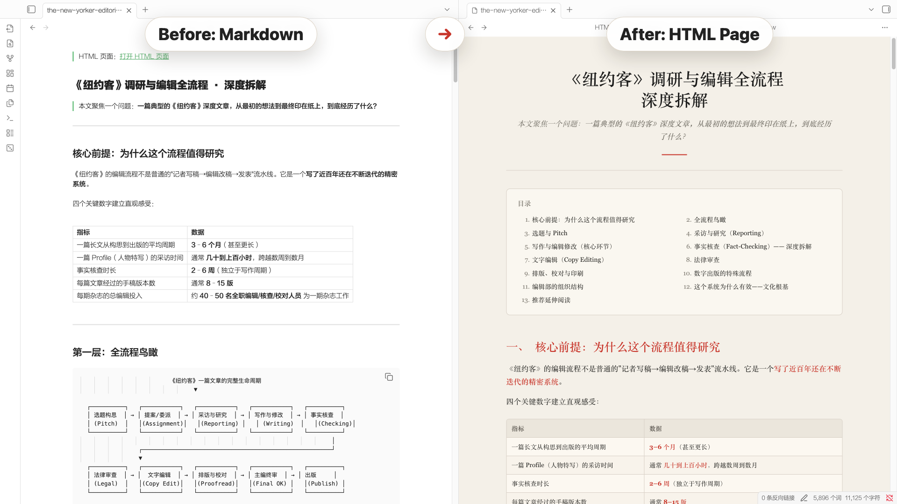
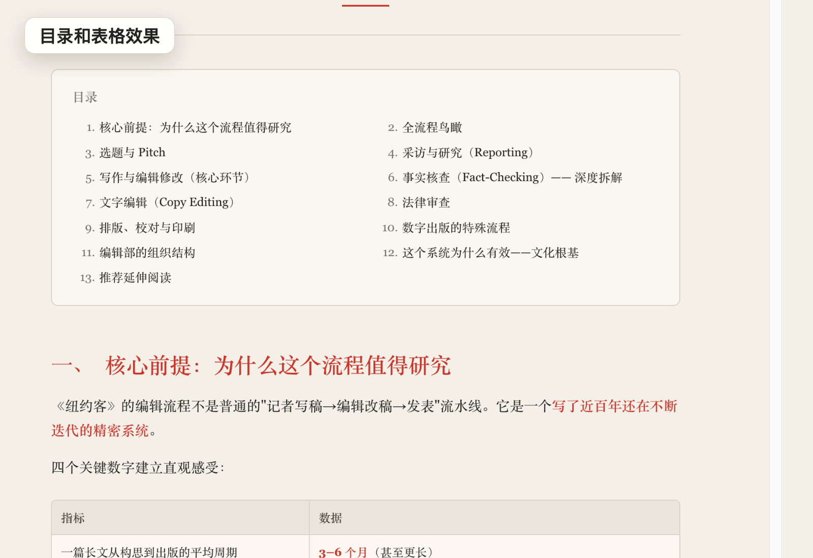

# Notes to HTML Pages

语言：中文介绍 / 展开下方 English README

## 中文介绍

将 Obsidian 的 Markdown 笔记转化为清晰易读、带目录的 HTML 页面，并且可以在 Obsidian 内直接阅读。它专注于深度长文阅读，让原本拥挤的笔记内容变成更像文章、报告或小册子的阅读页面，阅读体验提升 3 倍。

Notes to HTML Pages 是一个 Obsidian 插件，用来把本地 Markdown 笔记导出成清晰、素净、适合长文阅读的 HTML 页面。导出的页面不依赖外部网络，可以直接双击打开，也可以在 Obsidian 文件列表里直接点开阅读。

它特别适合这些场景：

- 把长笔记、调研文档、年度总结、深度文章导出成更舒服的阅读版。
- 自动生成可点击目录，方便在长文中快速跳转。
- 保留清晰的标题层级、引用块、重点提示、结论卡片、表格和 ASCII 图。
- 使用纯 CSS 与内联资源，离线也能阅读和分享。
- 在 Obsidian 内直接识别并打开 `.html` 文件，不需要离开自己的知识库。

## 效果预览





<details>
<summary>English README</summary>

Notes to HTML Pages exports Markdown notes into clean, standalone HTML pages that are easy to read offline and can also be opened directly inside Obsidian.

## Features

- Exports the current note or the current folder to `.html`.
- Produces self-contained HTML with inline CSS and no network dependency.
- Uses a restrained reading layout: narrow body, serif typography, clear headings, tables, code blocks, and blockquotes.
- Includes the `简洁` style preset with a compact title area, clickable table of contents, right-side wide-screen navigation, simple numbered entries, red section numbers, and soft quote boxes.
- Adds visual treatments for quotes, highlighted notes, conclusion callouts, stable scrolling tables, and code or ASCII diagram blocks.
- Preserves folder structure in the export folder by default.
- Converts wiki links toward same-name HTML pages when enabled.
- Embeds local images as data URIs when enabled.
- Registers an in-app HTML reader so exported `.html` files can be opened from the file explorer.
- Optionally inserts a clean backlink at the top of the source note.

## Install Manually

1. Download the release assets:
   - `main.js`
   - `manifest.json`
2. Create this folder inside your vault:

```text
.obsidian/plugins/notes-to-html-pages/
```

3. Put `main.js` and `manifest.json` in that folder.
4. Reload Obsidian.
5. Enable `Notes to HTML Pages` in Community plugins.

## Use

Open a Markdown note and run:

```text
Notes to HTML Pages: 导出当前笔记为 HTML 页面
```

You can also right-click a Markdown file or folder in the file explorer and choose the export command.

By default, exported files are saved to:

```text
HTML Pages/
```

The plugin settings let you change the export folder, style preset, folder structure behavior, wiki-link conversion, image embedding, in-app HTML reading, launcher note generation, and source-note backlink insertion.

## Privacy

All conversion happens locally in your vault. The plugin does not send note content to any external service.

## Development

```bash
npm install
npm run build
```

The production build writes `main.js` to the repository root.

## Release

For Obsidian community releases, the GitHub release tag must exactly match the version in `manifest.json`, without a `v` prefix. The release assets must include `main.js` and `manifest.json` as separate files.

## License

MIT

</details>
